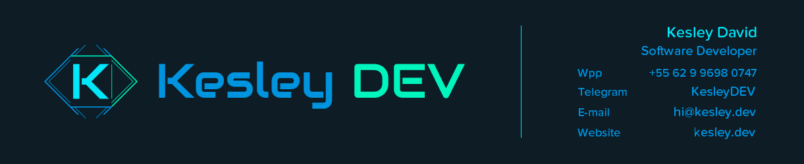
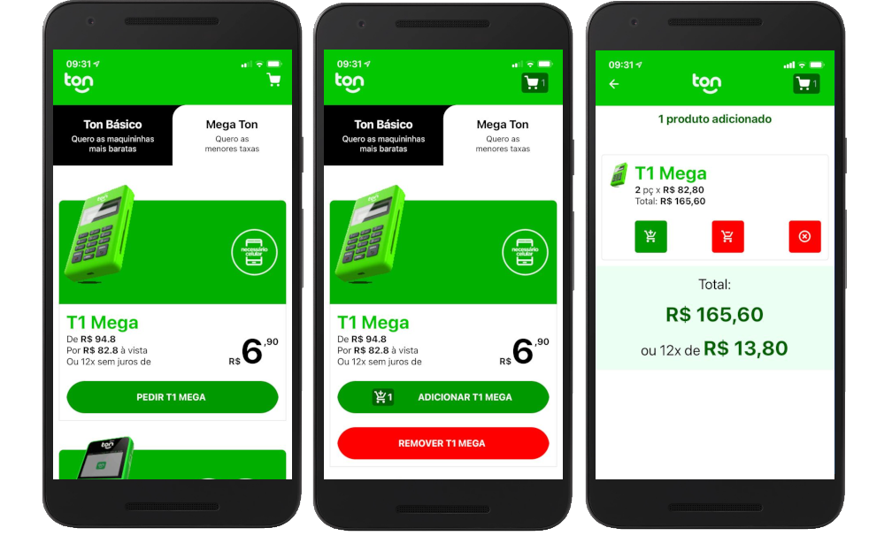

<h1 align="center">
  <a href="https://www.linkedin.com/in/kesleydavid/" target="_blank">
    
  </a>
</h1>

<p align="center">
  <a href="#">
    
  </a>
  <h3 align="center">Ton App</h3>
</p>

<p align="center">
  <a href="#-project">Project</a>&nbsp;&nbsp;&nbsp;|&nbsp;&nbsp;&nbsp;
  <a href="#-next-level">Next Level</a>&nbsp;&nbsp;&nbsp;|&nbsp;&nbsp;&nbsp;
  <a href="#-technologies">Technologies</a>&nbsp;&nbsp;&nbsp;|&nbsp;&nbsp;&nbsp;
  <a href="#-getting-started">Getting started</a>&nbsp;&nbsp;&nbsp;|&nbsp;&nbsp;&nbsp;
  <a href="#-tests">Tests</a>&nbsp;&nbsp;&nbsp;|&nbsp;&nbsp;&nbsp;
  <a href="#-movie">Movie</a>&nbsp;&nbsp;&nbsp;|&nbsp;&nbsp;&nbsp;
  <a href="#-license">License</a>
</p>

<p align="center">

  <a href="#">
    
  </a>

  <a href="https://www.linkedin.com/in/kesleydavid/" target="_blank">
    
  </a>

  <a href="#">
    
  </a>

  <a href="#">
      
  </a>

  <a href="#">
    
  </a>

  <a href="./LICENSE">
    
  </a>

</p>

<p align="center">
    
</p>

<hr>

## 💻 Project

Você foi escolhido para fazer um app de venda de produtos para o Ton. Nós vendemos maquininhas, mas fique à vontade para vender o que você quiser. Nesse desafio queremos entender seu conhecimento geral de React Native e que você consiga explicar seu código. Você pode usar bibliotecas, mas queremos que saiba explicar como elas funcionam.  

Reproduza o wireframe abaixo e utilize typescript. Não precisa se preocupar com a UI, não estamos avaliando isso no momento - mas vamos avaliar a UX. A lista de produtos deve ser carregada de um servidor - de preferência de um site/API público.  
  
**SUAS TAREFAS:** 

1. Criar uma tela de lista de produtos, com a possibilidade de adicionar e remover do carrinho (não precisa ter a opção de adicionar mais de 1 produto, mas fica à seu critério);  
2. Ao clicar no ícone do carrinho no header o usuário deve ser direcionado para o tela de carrinho onde vai listar os produtos dele, tendo a opção de excluir um produto do carrinho;
3. Fique à vontade para estender as funcionalidades para demonstrar seu conhecimento.
   
**BÔNUS**:  
Escrever testes para sua aplicação.

## 💎 Next Level 💎

- Controle de Estoque ao adicionar no carrinho  
- Opção para adicionar mais de um item de cada produto  
- Layout com mesma identidade do site (clientes saberão facilmente utilizar as duas plataformas)  
- Testado em Android e IOS
- Foi utilizado um **SERVIDOR BACKEND** desenvolvido por mim em nodeJS com typescript, embora simples, estou utilizando **Github Actions** e fazendo deploy em um servidor pessoal utilizando **docker** e cluster com **Docker Swarm** com proxy reverso (Traefik).

## 🔖 Technologies

Este projeto foi desenvolvido utilizando as seguintes tecnologias:  

- [React](https://reactjs.org)
- [TypeScript](https://www.typescriptlang.org/)
- [Expo](https://expo.io/)
- [Styled-Components](https://styled-components.com/)
- [Axios](https://github.com/axios/axios)

## 🚀 Getting started

Clone o projeto

```bash
$ git clone https://github.com/KesleyDavid/challenge-ton-react-native.git
```

Acesse o diretório
```bash
$ cd challenge-ton-react-native
```

Siga as etapas:
```bash
# Install the dependencies
$ yarn

# Start the mobile (frontend)
$ yarn start
```

## 🥇 Tests

```bash
  # Em Breve !
```

<!-- Run tests
```bash
$ yarn test
```

 -->

## 🎬 Movie


## 📝 License

Este projeto está licenciado sob a Licença MIT. Consulte o arquivo [LICENSE](LICENSE) para obter detalhes.


---

<p align="center">Made with ♥ by <a href="https://www.linkedin.com/in/kesleydavid/" target="_blank">Kesley DEV</a></p>